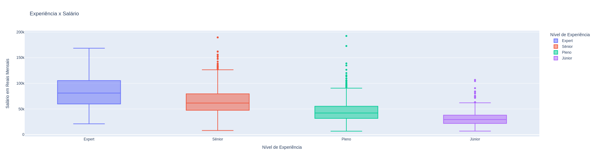
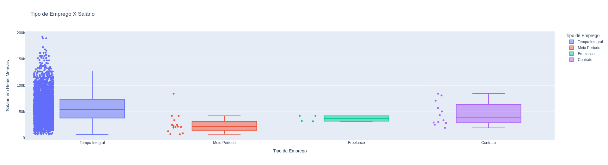
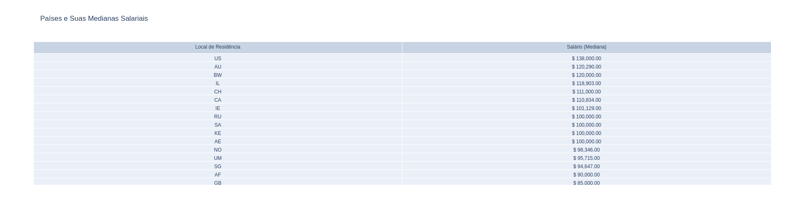
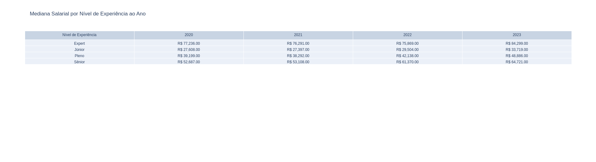
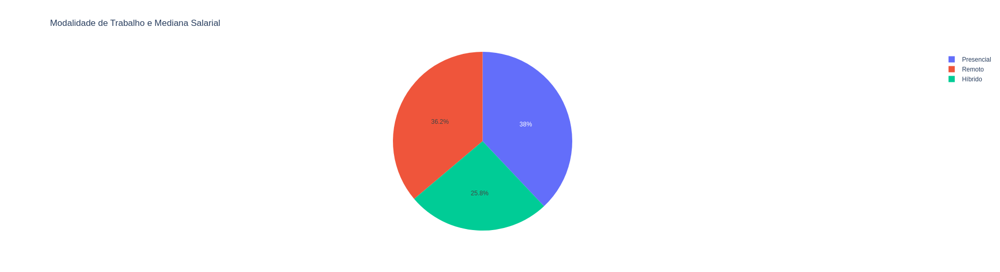

# Análise de Salários em Segurança Cibernética

## Introdução
Este projeto analisa os salários na área de segurança cibernética para fornecer insights sobre tendências salariais e padrões de emprego.

## Dataset Utilizado
- **Origem dos dados:** Dataset obtido do [Kaggle]).
- **Formato dos dados:** [CSV e JSON](./dataset/).

## Código-fonte
- [Python](./src/tp_grupo_05.py)

- [Colab](./src/TP_Grupo_05.ipynb)

## Bibliotecas Utilizadas
- Pandas: Manipulação e análise de dados.
- Requests: Consumo de uma API de dados monetários.
- Plotly: Visualização de dados.

## Perguntas e gráficos para análise de dados

- #### Pergunta 1: Meu salário aumenta com o tempo?

- #### Pergunta 2: Escolho entre flexibilidade de horário ou salário?

- #### Pergunta 3: Se eu sair do país, terei emprego?

- ####  Pergunta 4: Como é a média salarial de cada nível de experiência a cada ano?

- #### Pergunta 5: Se eu optar por trabalhar remotamente, vou receber bem?

## Análise e Resultados
- **Conceitos Explorados:** Relação entre experiência e salário, diferença salarial entre tipos de emprego, influência da modalidade de trabalho na remuneração.
- **Resultados Principais:** Destaque dos principais insights obtidos.

## Referências
- [MELHOR FORMA DE APRENDER PYTHON (Google Colab Notebook)](https://youtu.be/Gojqw9BQ5qY?feature=shared)
- [Data Science: Introdução a Ciência de Dados (Primeira aula prática programando em Python)](https://youtu.be/F608hzn_ygo?feature=shared)